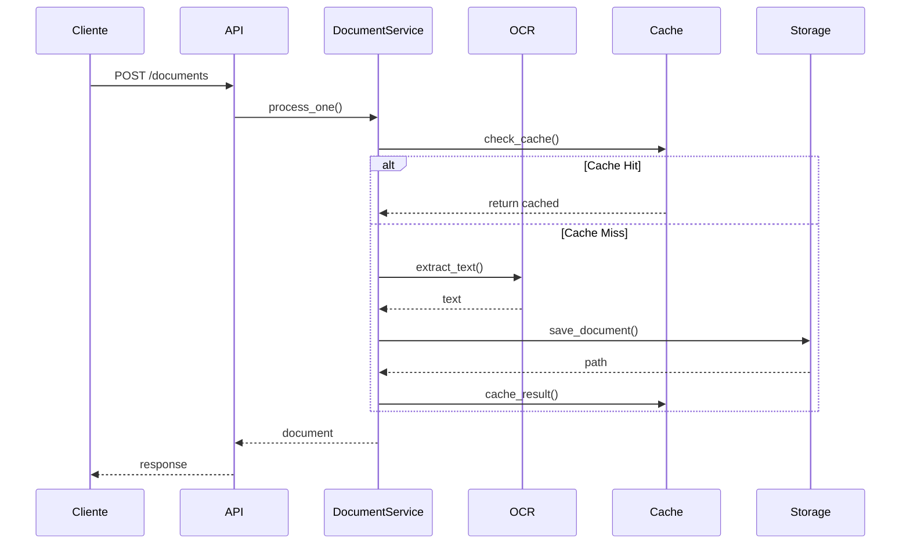

# Arquitectura

## Visión General

OCR-LLM implementa una arquitectura hexagonal (ports and adapters) para mantener el dominio de la aplicación aislado de los detalles técnicos.

## Estructura del Proyecto

```
src/
├── application/           # Capa de aplicación
│   ├── document_service.py
│   └── batch_service.py
├── domain/               # Capa de dominio
│   ├── models.py         # Entidades y value objects
│   ├── ports.py          # Puertos (interfaces)
│   └── use_cases.py      # Casos de uso
├── infrastructure/       # Adaptadores
│   ├── donut_adapter.py  # Implementación OCR
│   ├── file_storage.py   # Almacenamiento
│   ├── monitoring.py     # Monitoreo
│   └── redis_cache.py    # Caché
└── interfaces/          # Interfaces de usuario
    ├── cli.py           # CLI
    └── api/             # API REST
```

## Capas

### 1. Dominio

El núcleo de la aplicación, contiene:
- Entidades (Document, Page)
- Value Objects (ProcessingMetadata)
- Puertos (OcrPort, StoragePort)
- Reglas de negocio

### 2. Aplicación

Coordina el flujo de datos:
- DocumentService: Procesamiento de documentos
- BatchService: Procesamiento por lotes
- Manejo de transacciones
- Coordinación de operaciones

### 3. Infraestructura

Implementaciones técnicas:
- DonutAdapter: OCR con modelo Donut
- LocalFileStorage: Almacenamiento en disco
- RedisCache: Caché
- Monitoreo y métricas

### 4. Interfaces

Puntos de entrada:
- CLI para uso en línea de comandos
- API REST con FastAPI
- Documentación OpenAPI

## Flujo de Datos



## Patrones de Diseño

1. **Hexagonal Architecture**
   - Separación de conceptos
   - Inversión de dependencias
   - Testabilidad mejorada

2. **Repository Pattern**
   - Abstracción del almacenamiento
   - Intercambiabilidad de implementaciones

3. **Factory Pattern**
   - Creación de servicios
   - Configuración centralizada

4. **Strategy Pattern**
   - Algoritmos de OCR intercambiables
   - Flexibilidad en el procesamiento

## Consideraciones Técnicas

### Rendimiento

- Procesamiento asíncrono
- Sistema de caché
- Procesamiento por lotes
- Compresión de respuestas

### Escalabilidad

- Arquitectura stateless
- Caché distribuido
- Procesamiento paralelo
- Contenedores Docker

### Monitoreo

- Métricas Prometheus
- Trazabilidad distribuida
- Logging estructurado
- Healthchecks

### Seguridad

- Validación de entrada
- Sanitización de archivos
- Límites de tamaño
- Control de acceso

## Mejoras Futuras

1. **Escalabilidad**
   - Cluster de workers
   - Cola de mensajes
   - Almacenamiento distribuido

2. **Funcionalidad**
   - Más formatos de entrada
   - OCR multilenguaje
   - Análisis de layouts

3. **Seguridad**
   - Autenticación
   - Autorización
   - Cifrado

4. **Monitoreo**
   - Dashboard Grafana
   - Alertas
   - Análisis de tendencias
